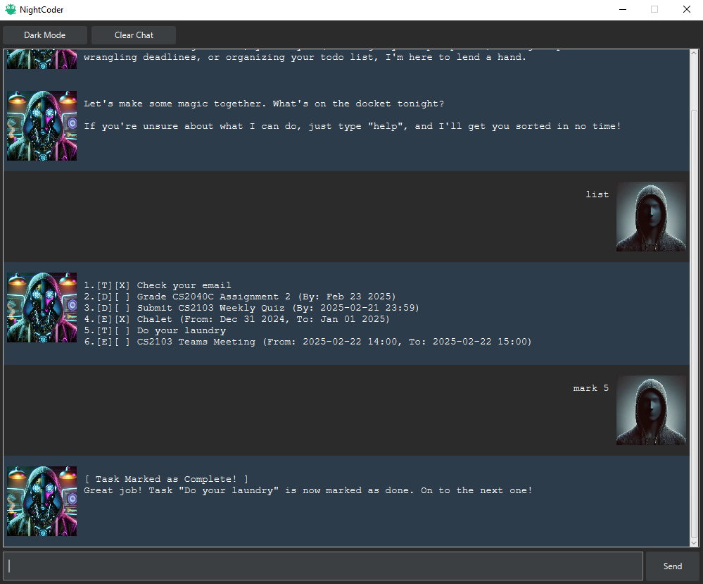

# NightCoder User Guide

## Welcome to `NightCoder`

`NightCoder` is your playful and motivational coding companion for late-night sessions. With a vibrant personality and powerful task management features, nightcoder.NightCoder is here to keep you organized, inspired, and focused.



---

## Features Overview

### Command Quick Reference Table

| Command                                         | Usage Example                                                                                                  |
|-------------------------------------------------|----------------------------------------------------------------------------------------------------------------|
| **[Help](#getting-help)**                       | `help`                                                                                                         |
| **[To-Do](#adding-to-dos)**                     | `todo <task description>` <br> _Example:_ `todo Finish the project report`                                     |
| **[Deadline](#adding-deadlines)**               | `deadline <task description> /by <due date>` <br> _Example:_ `deadline Submit assignment /by 2025-01-30 23:59` |
| **[Event](#adding-events)**                     | `event <description> /from <start> /to <end>` <br> _Example:_ `event Team meeting /from 3:00 PM /to 4:00 PM`   |
| **[List Tasks](#viewing-your-to-do-list)**      | `list`                                                                                                         |
| **[Mark Task](#marking-tasks-as-complete)**     | `mark <task number>` <br> _Example:_ `mark 1`                                                                  |
| **[Unmark Task](#marking-tasks-as-incomplete)** | `unmark <task number>` <br> _Example:_ `unmark 1`                                                              |
| **[Delete Task](#deleting-tasks)**              | `delete <task number>` <br> _Example:_ `delete 2`                                                              |

### Getting Help
Access a quick reference guide for all available commands.

**Command Syntax:**
```
help
```

**Example:**
```
help
```

**Expected Outcome:**
```
[ Night Code Command Guide ]
Need a hand? No problem! Here's what I can do for you:
    
help
- Prints this handy guide. Because even pros need reminders sometimes.
...
```

---

### Adding To-Dos
nightcoder.NightCoder lets you quickly add tasks to your to-do list, ensuring you don't forget important tasks during your coding adventures.

**Command Syntax:**
```
todo <task description>
```

**Example:**
```
todo Finish the project report
```

**Expected Outcome:**
```
[ Task #1 Added: Finish the project report ]
Got it! I'll keep this safe in your to-do list. Let me know what's next!
```

---

### Adding Deadlines
Keep track of time-sensitive tasks by adding deadlines.

**Command Syntax:**
```
deadline <task description> /by <due date and time>
```

**Example:**
```
deadline Submit assignment /by 2025-01-30 23:59
```

**Expected Outcome:**
```
[ Task #2 Added: Submit assignment ]
Got it! I'll keep this safe in your to-do list. Let me know what's next!
```

---

### Adding Events
Schedule events with specific start and end times to manage your calendar effectively.

**Command Syntax:**
```
event <event description> /from <start time> /to <end time>
```

**Example:**
```
event Team meeting /from 2025-01-21 3:00 PM /to 2025-01-21 4:00 PM
```

**Expected Outcome:**
```
[ Task #3 Added: Team meeting ]
Got it! I'll keep this safe in your to-do list. Let me know what's next!
```

---

### Viewing Your To-Do List
Get an overview of your tasks, including their completion status and descriptions.

**Command Syntax:**
```
list
```

**Example:**
```
list
```

**Expected Outcome:**
```
1. [T][ ] Finish the project report
2. [D][ ] Submit assignment (by: 2025-01-30 23:59)
3. [E][ ] Team meeting (from: 2025-01-21 3:00 PM to: 2025-01-21 4:00 PM)
```

---

### Marking Tasks as Complete
Track your progress by marking tasks as completed.

**Command Syntax:**
```
mark <task number>
```

**Example:**
```
mark 1
```

**Expected Outcome:**
```
[ Task Marked as Complete! ]
Great job! Task "Finish the project report" is now marked as done. On to the next one!
```

---

### Marking Tasks as Incomplete
Need to revisit a task? Mark it as incomplete.

**Command Syntax:**
```
unmark <task number>
```

**Example:**
```
unmark 1
```

**Expected Outcome:**
```
[ Task Marked as Incomplete! ]
Got it! Task "Finish the project report" is back on your to-do list. Let's tackle it when you're ready!
```

---

### Deleting Tasks
Clean up your to-do list by deleting tasks you no longer need.

**Command Syntax:**
```
delete <task number>
```

**Example:**
```
delete 2
```

**Expected Outcome:**
```
[ Task Deleted! ]
Task "Submit assignment" has been removed from your list. Poof, it's gone! Let me know if there's anything else to tidy up.
```

---

## Summary
`NightCoder` simplifies task management while keeping your coding spirits high. Whether you're organizing deadlines or clearing your to-do list, NightCoder is always here to assist. Happy coding!

